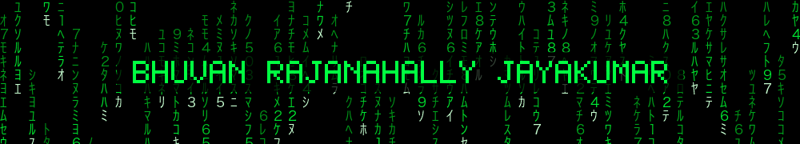
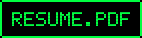
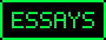
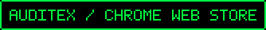

Backend and distributed systems engineer, building services that stay fast and correct under real load.
MS Computer Science, USC, graduating December 2026 · Los Angeles, CA

    

**[Project Hydra](https://github.com/BHUVAN-RJ/Project-Hydra)**, a backend scale-engineering platform: real Docker deployments, real load tests, and a projection engine that models system behavior at scale with confidence intervals using the Universal Scalability Law and queuing theory. 30 lessons, six modules, MIT licensed.

**[Preference falsification and LLM sycophancy](https://github.com/BHUVAN-RJ/Preference-falsification-and-LLM-sycophancy)**, first author, preprint in preparation. Measures whether multi-agent LLM networks reproduce the cascade dynamics in Timur Kuran's theory: every agent makes separate private and public LLM calls each round, across seven conditions varying network topology, social pressure, and memory.

- **Backend & Cloud Engineering Intern**, USC Grand Challenges Scholars Program, Jul 2026 to present. Lead the backend team for a multi-university scholars platform: auth, accounts, discussion, and permissions separating student and alumni access. Own the API contract frontend builds against.
- **Software Engineer Intern**, Stylebot, Apr to Aug 2025. Owned a FastAPI NLP microservice for 20+ enterprise media clients at 50K+ requests/day. Cut p95 latency 52%, 2.3s to 1.1s, with Redis caching and async I/O. USC Early Career Innovator Award.
- **Project Intern**, Indian Institute of Science, Oct 2023 to May 2024. Pose-estimation keypoint accuracy 70% to 95%, annotation time 60s to 15s across 10,000+ images. Led 4 interns.
- **Google Summer of Code**, Plone Foundation, 2022. Ported the ftw.trash recycle-bin add-on and two dependencies from Python 2 to 3 for Plone 6, plus ~50 tests.

 

**Backend:** Python · FastAPI · Redis · PostgreSQL · Docker · CI/CD · load testing · C++ · TypeScript

**AI systems:** LLM agents · multi-agent systems · agentic workflows · MCP servers · voice agents · RAG · retrieval pipelines · model fine-tuning · LLM evaluation · on-device LLMs · ONNX Runtime · model quantization · PyTorch · browser automation with Playwright
